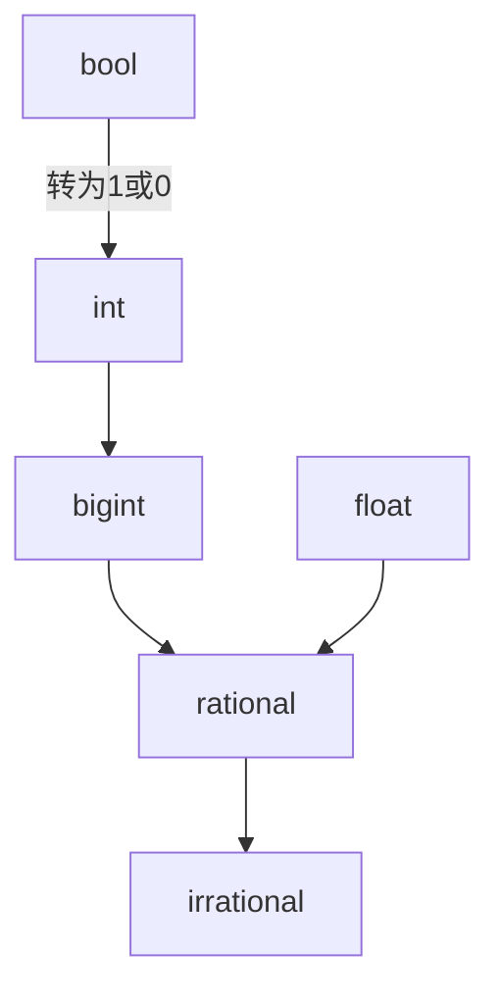

# LSR 005 - Lamina的变量

## 基本信息

- LSR 编号 005
- 标题 Lamina的变量
- 作者 CGrakeski
- 状态 草案
- 类型 标准规范类
- 创建日期 08-16-2025
- Lamina 版本 不适用

## 摘要

本LSR描述了关于Lamina变量的赋值，使用与类型转换。

 ## 技术规范

### 简介

Lamina的变量的定义有如下两种方式：

```Lamina
var [变量名] = [值]; // 可选的var关键字，用来自动推导类型
```

``````Lamina
[类型] [变量名] = [值];
``````

若不同类型相运算，则如下类型之间可以互相运算：

``````
int float rational irrational bool bigint
``````

而其余的类型仅能与相同的类型进行计算。

隐式类型转换过程如下图：



若定义变量时声明的类型与定义变量时设置的数据的实际类型不同，则进行隐式类型转换。隐式转换会损坏一部分数据但不报错的（如bigint转int），将变量设为输入原数据的类型。若没有隐式类型转换方法，则报错。若数学计算时存在不同类型，最终结果类型为运算数类型中在上文流程图中最靠近irrational类型的类型。若运算数类型中有不可隐式转换的类型，此时若运算数中存在任意一个不同类型，报出TypeError错误。

除隐式转换外，还可以显式转换，形如：

``````Lamina
[转换到的类型]([变量名/值])
int("32")
``````

以下是显式转换图：

``````mermaid
graph TD
    %% 基础类型分组
    bool
    int
    float
    bigint
    rational
    irrational
    string

    %% 布尔值转换
    bool --> int
    bool --> bigint
    bool --> string
    bool --> float
    bool --> rational
    bool --> irrational

    %% 整型转换
    int --> bigint
    int --> |部分|bool
    int --> float
    int --> rational
    int --> irrational
    int --> string

    %% 大整数转换
    bigint --> |部分|bool
    bigint --> |部分|int
    bigint --> |部分|float
    bigint --> |部分|rational
    bigint --> |部分|irrational
    bigint --> string

    %% 浮点数转换
    float --> |部分|bool
    float --> |可能丢失精度|int
    float --> |可能丢失精度|bigint
    float <--> rational
    float --> irrational
    float --> string

    %% 有理数转换
    rational --> |部分|bool
    rational --> |可能丢失精度|int
    rational --> |可能丢失精度|bigint
    rational --> irrational
    rational --> string

    %% 无理数转换
    irrational --> |部分|bool
    irrational --> |部分|int
    irrational --> |可能丢失精度/部分|float
    irrational --> |可能丢失精度/部分|bigint
    irrational --> |可能丢失精度/部分|rational
    irrational --> string
    
    %% 字符串转换
    string --> |部分|bool
    string --> |部分|int
    string --> |部分|float
    string --> |部分|bigint
    string --> |部分|rational
    string --> |部分|irrational
``````

